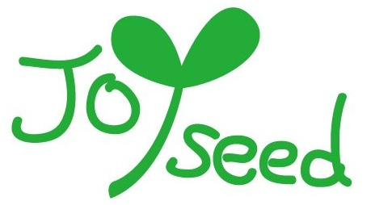

## JoySeed 基本介绍

&emsp;是一家同时注册于加拿大多伦多和中国上海的现代化      
教育科技公司。作为英语教育的先锋者，&emsp;
充分依托北      
美先进的教育资源，借助最前沿的教育科技，在全球范围内推广高            
品质的英语学习课程。                                  

## &emsp;&emsp;  我们的愿景：              
&emsp;&emsp;&emsp;&emsp;&emsp;播种快乐学习之芽&emsp;打开成功求学之门          

## &emsp;&emsp;&emsp;&emsp; 课堂形式：                   
&emsp;&emsp;&emsp;&emsp;&emsp;&emsp;&emsp;&emsp;JoySeed课程共包括入门级在内的七个等级。学生以等级为      
&emsp;&emsp;&emsp;&emsp;&emsp;&emsp;&emsp;&emsp;单元报名，每一等级包含九个相互独立的主题，每单元9课      
&emsp;&emsp;&emsp;&emsp;&emsp;&emsp;&emsp;&emsp;时（40分钟/课时），总计81课时/等级。                     
  
&emsp;&emsp;&emsp;&emsp;&emsp;&emsp;&emsp;&emsp;每位学生可在报名前免费试听一课时。正式报名后，学生可            
&emsp;&emsp;&emsp;&emsp;&emsp;&emsp;&emsp;&emsp;根据自己需求，每周安排两至三节课，每节课60分钟（1.5课时）。      
  
## &emsp;&emsp;&emsp;&emsp;&emsp;&emsp;联系方式：   

