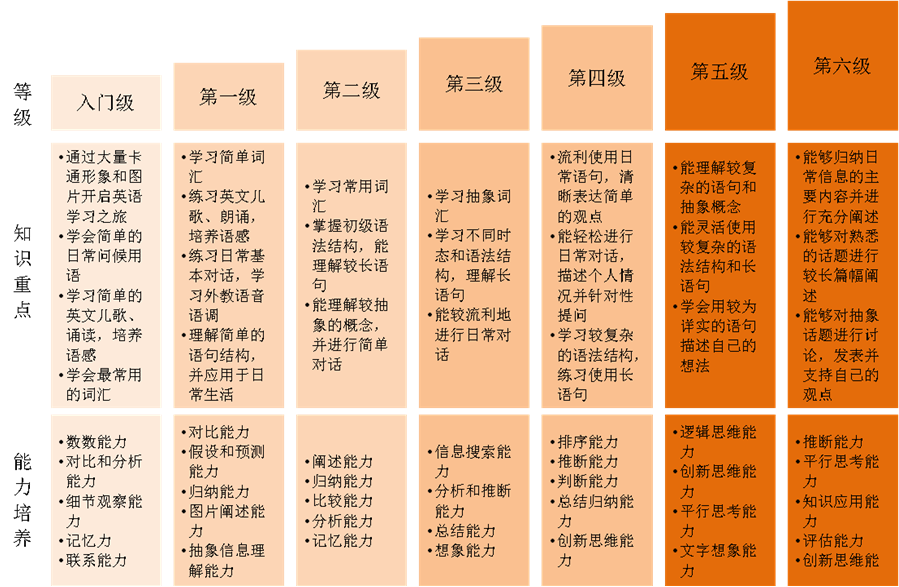

## 我们的课程介绍:

    
## JoySeed 课堂带给学生受益终身的能力：
* 英语语言能力：    
  JoySeed课堂完全摆脱“哑巴式”的英语学习模式，北美外教手把手地纠正语音语调。学生通过每节课跟着外教学习，从小掌握一口地道的北美英语发音。

* 沟通交往能力:     
  很多学生面对外国人时表现比较害羞，不敢大声交谈。JoySeed北美外教充分鼓励学生在课堂上自由表达自己的意见和观点，从小培养沟通的能力和技巧，并在长期的交谈中充分培养学生的自信心。

* 辩证思维能力：   
  语言学习绝不仅仅是一个记忆知识的过程，语言的本质是思维的载体。JoySeed课堂通过各种活动真正培养学生对知识的掌握和应用能力，鼓励学生在日常生活中学会用英语的方式来思考和表达自己的观点。

* 文化感知能力：   
  通过JoySeed课堂，学生与来自不同国家、不同种族和不同文化背景的外教零距离接触，密切感知西方国家的思维模式和风俗人情，拓宽视野，充分体验多元文化的魅力。

